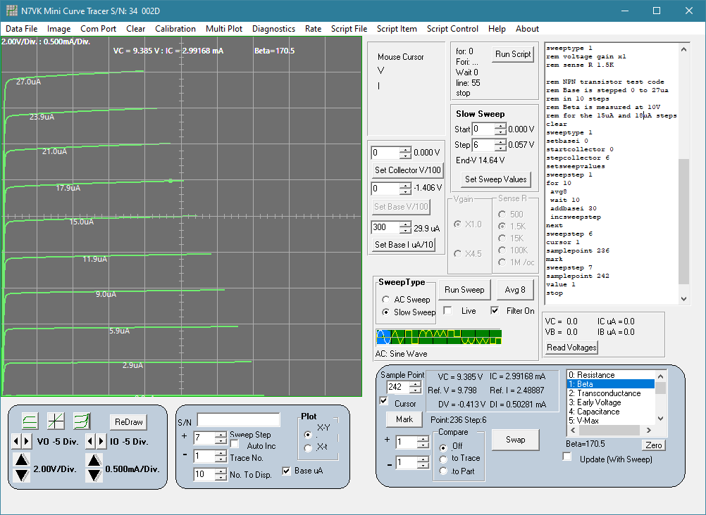

# minict

This repository is an archive for the N7VK Mini Curve Tracer source code. For the original version, two key components, the C8051F121-GQ micro and the DPL-USB1232H serial to USB converter are still available. However, newer processors such as the Raspberry Pi Pico2 can reduce the cost considerably with only a slight decrease in analog performance.

The Pico CT folder contains a design upgrade using the Pico2 processor. Instead of a single double sided PC board, the design has been split to two boards. Each board can be CNC milled on a single sided copper clad board.

.
The new curve tracer assembly.

.
Curves for a 2N2222A transistor.

.
Hysteresis traces for a DIP relay.

.
Measuring an LED turn on voltage and series resistance.

.
Capacitor measurement showing the current and voltage plots over time. 
